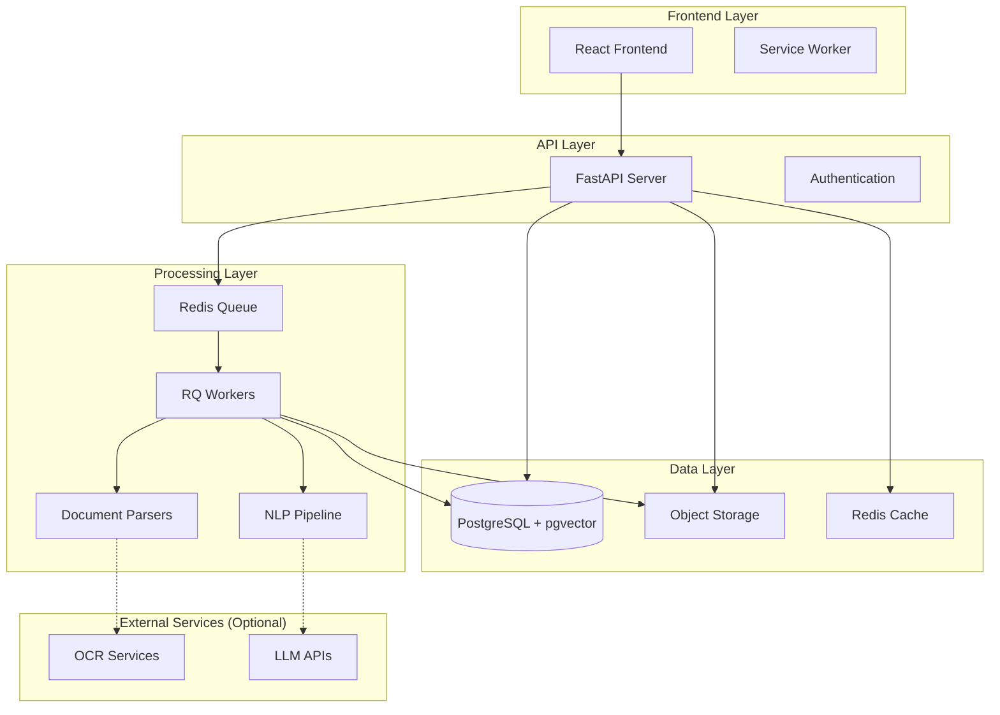

# Design Document

## Overview

The Document Learning App is a full-stack application that transforms documents into interactive learning experiences through automated content extraction and spaced repetition. The system uses a microservices architecture with FastAPI backend, React frontend, and background processing workers to handle document parsing, NLP extraction, and flashcard generation.

### Key Design Principles

- **Modular Architecture**: Separate concerns with distinct services for parsing, NLP, and learning
- **Asynchronous Processing**: Use background workers for heavy document processing
- **Pluggable Components**: Support multiple parsers, NLP models, and storage backends
- **Privacy-First**: Local processing options with no mandatory external API dependencies
- **Scalable Design**: Queue-based processing with horizontal scaling capabilities

## Architecture

### System Architecture



### Technology Stack

**Backend:**
- FastAPI (Python 3.11) - REST API server
- SQLAlchemy + Alembic - ORM and database migrations
- PostgreSQL + pgvector - Primary database with vector search
- Redis - Caching and task queue
- RQ (Redis Queue) - Background job processing

**Document Processing:**
- PyMuPDF (fitz) - PDF parsing and image extraction
- python-docx - DOCX document processing
- python-markdown - Markdown parsing
- Pillow - Image processing and manipulation

**NLP and ML:**
- sentence-transformers - Multilingual text embeddings
- spaCy - English NLP pipeline
- jieba/HanLP - Chinese text processing
- scikit-learn - Text analysis and clustering

**Frontend:**
- React 18 + TypeScript - UI framework
- Vite - Build tool and dev server
- Tailwind CSS - Styling framework
- TanStack Query - Server state management
- React Router - Client-side routing
- Framer Motion - Animations

**Infrastructure:**
- Docker + Docker Compose - Containerization
- GitHub Actions - CI/CD pipeline
- Nginx - Reverse proxy (production)

## Components and Interfaces

### Core Models

```python
# Document hierarchy
class Document:
    id: UUID
    filename: str
    file_type: str
    status: ProcessingStatus
    metadata: dict
    created_at: datetime
    
class Chapter:
    id: UUID
    document_id: UUID
    title: str
    level: int
    order_index: int
    page_start: int
    page_end: int
    
class Figure:
    id: UUID
    chapter_id: UUID
    image_path: str
    caption: str
    page_number: int
    bbox: dict  # {x, y, width, height}
    
# Knowledge extraction
class Knowledge:
    id: UUID
    chapter_id: UUID
    kind: KnowledgeType  # definition, fact, theorem, process, example
    text: str
    entities: list[str]
    anchors: dict  # {page, chapter, position}
    embedding: vector
    
# Learning system
class Card:
    id: UUID
    knowledge_id: UUID
    card_type: CardType  # qa, cloze, image_hotspot
    front: str
    back: str
    difficulty: float
    metadata: dict  # hotspots, blanks, etc.
    
class SRS:
    id: UUID
    card_id: UUID
    user_id: UUID
    ease_factor: float
    interval: int
    repetitions: int
    due_date: datetime
    last_reviewed: datetime
```

### Document Processing Pipeline

```python
class DocumentProcessor:
    def __init__(self):
        self.parsers = {
            'pdf': PDFParser(),
            'docx': DocxParser(), 
            'md': MarkdownParser()
        }
        self.nlp_pipeline = NLPPipeline()
        
    async def process_document(self, doc_id: UUID):
        """Main processing pipeline"""
        doc = await self.get_document(doc_id)
        
        # 1. Parse document structure
        content = await self.parse_content(doc)
        
        # 2. Extract chapters
        chapters = await self.extract_chapters(content)
        
        # 3. Pair images with captions
        figures = await self.extract_figures(content, chapters)
        
        # 4. Segment text into knowledge candidates
        segments = await self.segment_text(chapters)
        
        # 5. Extract knowledge points
        knowledge = await self.extract_knowledge(segments)
        
        # 6. Generate flashcards
        cards = await self.generate_cards(knowledge, figures)
        
        # 7. Deduplicate and assign difficulty
        cards = await self.deduplicate_cards(cards)
        
        return ProcessingResult(chapters, figures, knowledge, cards)
```

### Parser Interfaces

```python
class BaseParser(ABC):
    @abstractmethod
    async def parse(self, file_path: str) -> ParsedContent:
        pass
        
class ParsedContent:
    text_blocks: list[TextBlock]
    images: list[ImageData]
    metadata: dict
    
class TextBlock:
    text: str
    page: int
    bbox: dict
    font_info: dict
    
class ImageData:
    image_path: str
    page: int
    bbox: dict
    format: str
```

### NLP Pipeline

```python
class NLPPipeline:
    def __init__(self):
        self.entity_extractor = EntityExtractor()
        self.knowledge_extractor = KnowledgeExtractor()
        self.embedding_model = SentenceTransformer('paraphrase-multilingual-MiniLM-L12-v2')
        
    async def extract_knowledge(self, segments: list[TextSegment]) -> list[Knowledge]:
        knowledge_points = []
        
        for segment in segments:
            # Extract entities
            entities = await self.entity_extractor.extract(segment.text)
            
            # Extract structured knowledge
            if self.use_llm:
                knowledge = await self.llm_extract(segment)
            else:
                knowledge = await self.rule_extract(segment)
                
            # Generate embeddings
            for kp in knowledge:
                kp.embedding = self.embedding_model.encode(kp.text)
                
            knowledge_points.extend(knowledge)
            
        return knowledge_points
```

### Card Generation System

```python
class CardGenerator:
    def generate_qa_card(self, knowledge: Knowledge) -> Card:
        """Generate Q&A card from definition knowledge"""
        if knowledge.kind == 'definition':
            # Extract term and definition
            term, definition = self.parse_definition(knowledge.text)
            return Card(
                front=f"What is {term}?",
                back=definition,
                card_type='qa'
            )
            
    def generate_cloze_card(self, knowledge: Knowledge) -> Card:
        """Generate cloze deletion card"""
        entities = knowledge.entities[:3]  # Max 3 blanks
        text_with_blanks = self.create_blanks(knowledge.text, entities)
        
        return Card(
            front=text_with_blanks,
            back=knowledge.text,
            card_type='cloze',
            metadata={'blanks': entities}
        )
        
    def generate_image_card(self, figure: Figure, knowledge: Knowledge) -> Card:
        """Generate image hotspot card"""
        hotspots = self.identify_hotspots(figure, knowledge)
        
        return Card(
            front=figure.image_path,
            back=figure.caption,
            card_type='image_hotspot',
            metadata={'hotspots': hotspots}
        )
```

## Data Models

### Database Schema

```sql
-- Core document structure
CREATE TABLE documents (
    id UUID PRIMARY KEY,
    filename VARCHAR(255) NOT NULL,
    file_type VARCHAR(10) NOT NULL,
    status VARCHAR(20) DEFAULT 'pending',
    metadata JSONB,
    created_at TIMESTAMP DEFAULT NOW()
);

CREATE TABLE chapters (
    id UUID PRIMARY KEY,
    document_id UUID REFERENCES documents(id),
    title VARCHAR(500) NOT NULL,
    level INTEGER NOT NULL,
    order_index INTEGER NOT NULL,
    page_start INTEGER,
    page_end INTEGER
);

CREATE TABLE figures (
    id UUID PRIMARY KEY,
    chapter_id UUID REFERENCES chapters(id),
    image_path VARCHAR(500) NOT NULL,
    caption TEXT,
    page_number INTEGER,
    bbox JSONB
);

-- Knowledge and learning
CREATE TABLE knowledge (
    id UUID PRIMARY KEY,
    chapter_id UUID REFERENCES chapters(id),
    kind VARCHAR(20) NOT NULL,
    text TEXT NOT NULL,
    entities TEXT[],
    anchors JSONB,
    embedding VECTOR(384)  -- pgvector
);

CREATE TABLE cards (
    id UUID PRIMARY KEY,
    knowledge_id UUID REFERENCES knowledge(id),
    card_type VARCHAR(20) NOT NULL,
    front TEXT NOT NULL,
    back TEXT NOT NULL,
    difficulty FLOAT DEFAULT 1.0,
    metadata JSONB
);

CREATE TABLE srs (
    id UUID PRIMARY KEY,
    card_id UUID REFERENCES cards(id),
    user_id UUID,
    ease_factor FLOAT DEFAULT 2.5,
    interval INTEGER DEFAULT 1,
    repetitions INTEGER DEFAULT 0,
    due_date TIMESTAMP DEFAULT NOW(),
    last_reviewed TIMESTAMP
);

-- Indexes for performance
CREATE INDEX idx_knowledge_embedding ON knowledge USING ivfflat (embedding vector_cosine_ops);
CREATE INDEX idx_srs_due_date ON srs (due_date);
CREATE INDEX idx_cards_type ON cards (card_type);
```

### API Response Models

```python
class DocumentResponse(BaseModel):
    id: UUID
    filename: str
    status: str
    chapter_count: int
    figure_count: int
    knowledge_count: int
    created_at: datetime

class ChapterResponse(BaseModel):
    id: UUID
    title: str
    level: int
    figures: list[FigureResponse]
    knowledge_count: int

class CardResponse(BaseModel):
    id: UUID
    card_type: str
    front: str
    back: str
    difficulty: float
    due_date: datetime
    metadata: dict
```

## Error Handling

### Processing Error Recovery

```python
class ProcessingError(Exception):
    def __init__(self, stage: str, message: str, recoverable: bool = True):
        self.stage = stage
        self.message = message
        self.recoverable = recoverable

class ErrorHandler:
    async def handle_parsing_error(self, doc_id: UUID, error: Exception):
        """Handle document parsing failures"""
        if isinstance(error, UnsupportedFormatError):
            await self.mark_document_failed(doc_id, "Unsupported format")
        elif isinstance(error, CorruptedFileError):
            await self.mark_document_failed(doc_id, "File corrupted")
        else:
            # Retry with fallback parser
            await self.retry_with_fallback(doc_id)
            
    async def handle_nlp_error(self, segment_id: UUID, error: Exception):
        """Handle NLP extraction failures"""
        if self.llm_available and isinstance(error, LLMTimeoutError):
            # Fall back to rule-based extraction
            return await self.rule_based_extraction(segment_id)
        else:
            # Skip this segment and continue
            await self.log_extraction_failure(segment_id, error)
```

### API Error Responses

```python
class ErrorResponse(BaseModel):
    error_code: str
    message: str
    details: dict = {}

# Standard error codes
ERROR_CODES = {
    'UNSUPPORTED_FORMAT': 'Document format not supported',
    'FILE_TOO_LARGE': 'File exceeds maximum size limit',
    'PROCESSING_FAILED': 'Document processing failed',
    'CARD_NOT_FOUND': 'Flashcard not found',
    'INVALID_GRADE': 'Grade must be between 0 and 5'
}
```

## Testing Strategy

### Unit Testing

```python
# Test document parsing
class TestPDFParser:
    def test_extract_text_blocks(self):
        parser = PDFParser()
        content = parser.parse('sample.pdf')
        assert len(content.text_blocks) > 0
        assert all(block.page > 0 for block in content.text_blocks)
        
    def test_extract_images(self):
        parser = PDFParser()
        content = parser.parse('sample_with_images.pdf')
        assert len(content.images) >= 2
        assert all(img.bbox for img in content.images)

# Test knowledge extraction
class TestKnowledgeExtractor:
    def test_definition_extraction(self):
        text = "Machine learning is a subset of artificial intelligence..."
        extractor = KnowledgeExtractor()
        knowledge = extractor.extract_definitions(text)
        assert len(knowledge) >= 1
        assert knowledge[0].kind == 'definition'
        
# Test SRS algorithm
class TestSRS:
    def test_sm2_algorithm(self):
        srs = SRSState(ease_factor=2.5, interval=1, repetitions=0)
        
        # Grade 5 (perfect)
        new_srs = sm2_update(srs, 5)
        assert new_srs.interval > srs.interval
        assert new_srs.repetitions == 1
        
        # Grade 2 (poor)
        poor_srs = sm2_update(srs, 2)
        assert poor_srs.repetitions == 0
        assert poor_srs.interval == 1
```

### Integration Testing

```python
class TestDocumentProcessingPipeline:
    async def test_full_pipeline(self):
        """Test complete document processing"""
        # Upload document
        doc_id = await self.upload_test_document()
        
        # Wait for processing
        await self.wait_for_processing(doc_id)
        
        # Verify results
        doc = await self.get_document(doc_id)
        assert doc.status == 'completed'
        
        chapters = await self.get_chapters(doc_id)
        assert len(chapters) >= 1
        
        cards = await self.get_cards(doc_id)
        assert len(cards) >= 5
        
        # Test card review
        card = cards[0]
        await self.grade_card(card.id, 4)
        
        updated_srs = await self.get_srs(card.id)
        assert updated_srs.due_date > datetime.now()
```

### Performance Testing

```python
class TestPerformance:
    def test_document_processing_time(self):
        """Ensure processing completes within acceptable time"""
        start_time = time.time()
        
        # Process 10-page PDF
        result = self.process_document('10_page_sample.pdf')
        
        processing_time = time.time() - start_time
        assert processing_time < 30  # 30 seconds max
        
    def test_search_response_time(self):
        """Test search performance"""
        start_time = time.time()
        
        results = self.search_knowledge("machine learning")
        
        search_time = time.time() - start_time
        assert search_time < 0.5  # 500ms max
        assert len(results) > 0
```

### Acceptance Testing

```python
class TestAcceptanceCriteria:
    def test_chapter_recognition_accuracy(self):
        """Test chapter structure recognition accuracy >= 95%"""
        test_docs = self.load_test_documents_with_gold_standard()
        
        total_chapters = 0
        correct_chapters = 0
        
        for doc, expected_chapters in test_docs:
            extracted_chapters = self.extract_chapters(doc)
            
            total_chapters += len(expected_chapters)
            correct_chapters += self.count_matching_chapters(
                extracted_chapters, expected_chapters
            )
            
        accuracy = correct_chapters / total_chapters
        assert accuracy >= 0.95
        
    def test_image_caption_pairing_accuracy(self):
        """Test image-caption pairing accuracy >= 90%"""
        test_images = self.load_test_images_with_captions()
        
        correct_pairs = 0
        total_pairs = len(test_images)
        
        for image_data, expected_caption in test_images:
            extracted_caption = self.extract_caption(image_data)
            
            if self.captions_match(extracted_caption, expected_caption):
                correct_pairs += 1
                
        accuracy = correct_pairs / total_pairs
        assert accuracy >= 0.90
```

This design provides a comprehensive foundation for building the document learning app with all the features specified in your requirements. The architecture is modular, scalable, and includes proper error handling and testing strategies.