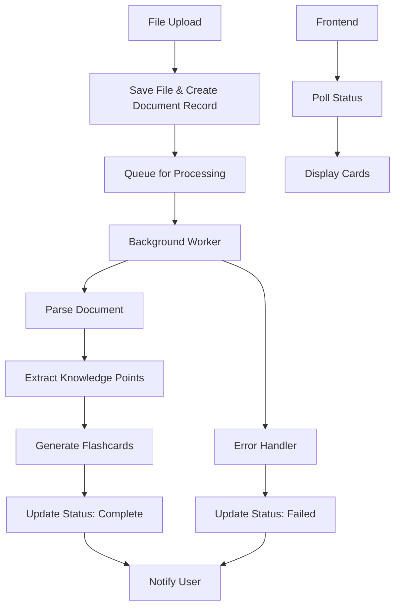

# Flashcard Generation Fix - Design Document

## Overview

This design addresses the critical gap between file upload and flashcard generation in the document learning application. The current system has all the necessary components (parsers, knowledge extraction, card generation) but they're not properly connected to the upload workflow. This design creates a complete pipeline from file upload to flashcard availability.

## Architecture

### Current State Analysis

**Existing Components:**
- File upload endpoint (`/api/ingest`) - basic implementation but has issues
- Document parsers (PDF, DOCX, TXT, MD) - implemented but not used
- Knowledge extraction service - sophisticated but disconnected
- Card generation service - comprehensive but not triggered
- Database models - complete schema for documents, knowledge, and cards

**Critical Issues:**
- Upload endpoint has import/dependency issues
- Documents router is commented out due to errors
- No database integration in upload flow
- Missing proper error handling and validation
- No connection between upload and processing services

**Missing Connections:**
- Working file upload with database integration
- Background processing queue integration
- Document processing pipeline orchestration
- Automatic card generation triggers
- Status tracking and user feedback

### Proposed Architecture



## Components and Interfaces

### 1. Fixed Upload Endpoint

**Priority:** Fix basic upload functionality first

**Issues to Address:**
- Import errors preventing documents router from loading
- Missing database integration in upload flow
- Incomplete file validation and security
- No proper document record creation

**File:** `backend/main.py` (fix existing `/api/ingest`)

```python
@app.post("/api/ingest")
async def ingest_document(file: UploadFile = File(...), db: AsyncSession = Depends(get_async_db)):
    # 1. Fix import issues and database dependencies
    # 2. Validate file type, size, and security
    # 3. Save file securely with proper naming
    # 4. Create document record in database with PENDING status
    # 5. Return document ID and status for frontend tracking
    # 6. Handle errors gracefully with proper HTTP responses
```

**Alternative:** Re-enable the documents router with fixed imports

```python
# Fix import issues in backend/app/api/documents.py
# Re-enable: app.include_router(documents_router, tags=["documents"])
```

### 2. Document Processing Pipeline

**New Service:** `backend/app/services/document_processing_pipeline.py`

```python
class DocumentProcessingPipeline:
    async def process_document(self, document_id: UUID):
        # 1. Load document from database
        # 2. Parse file based on type (PDF/DOCX/TXT/MD)
        # 3. Extract chapters and structure
        # 4. Extract knowledge points and entities
        # 5. Generate flashcards
        # 6. Update document status
        # 7. Handle errors gracefully
```

### 3. Background Task Queue

**Integration:** Use existing `QueueService` or implement simple async processing

```python
class ProcessingQueue:
    async def enqueue_document(self, document_id: UUID):
        # Add to processing queue
        
    async def process_next(self):
        # Get next document from queue
        # Process using DocumentProcessingPipeline
```

### 4. Status Tracking API

**New Endpoints:** Extend existing document API

```python
@router.get("/api/documents/{document_id}/status")
async def get_processing_status(document_id: UUID):
    # Return current processing status and progress
    
@router.post("/api/documents/{document_id}/retry")
async def retry_processing(document_id: UUID):
    # Retry failed processing
```

### 5. Frontend Integration

**Enhanced Components:**
- Upload progress with processing status
- Document list with processing indicators
- Automatic refresh when processing completes
- Error handling with retry options

## Data Models

### Document Status Enhancement

```python
class ProcessingStatus(Enum):
    PENDING = "pending"
    PROCESSING = "processing" 
    PARSING = "parsing"
    EXTRACTING = "extracting"
    GENERATING_CARDS = "generating_cards"
    COMPLETED = "completed"
    FAILED = "failed"
```

### Processing Metadata

```python
# Add to Document model
processing_metadata = {
    "started_at": datetime,
    "completed_at": datetime,
    "error_message": str,
    "progress": {
        "current_step": str,
        "total_steps": int,
        "current_step_number": int
    },
    "stats": {
        "pages_processed": int,
        "knowledge_points_extracted": int,
        "cards_generated": int
    }
}
```

## Error Handling

### Error Categories

1. **File Format Errors**
   - Unsupported file type
   - Corrupted file
   - Password-protected documents

2. **Processing Errors**
   - Parser failures
   - Memory/timeout issues
   - Database connection errors

3. **Generation Errors**
   - Insufficient content for cards
   - Knowledge extraction failures

### Error Recovery Strategy

```python
class ErrorHandler:
    async def handle_processing_error(self, document_id: UUID, error: Exception):
        # 1. Log detailed error information
        # 2. Update document status with error details
        # 3. Determine if retry is possible
        # 4. Clean up partial processing results
        # 5. Notify user with actionable message
```

## Testing Strategy

### Unit Tests
- Document parser functionality
- Knowledge extraction accuracy
- Card generation logic
- Error handling scenarios

### Integration Tests
- Complete upload-to-cards pipeline
- Database transaction integrity
- Queue processing reliability
- Status update accuracy

### End-to-End Tests
- Upload various file types
- Verify cards are generated and accessible
- Test error scenarios and recovery
- Performance with large documents

## Implementation Phases

### Phase 1: Fix Upload Functionality (Priority: Critical)
1. **Fix import issues** - Resolve dependency problems preventing documents router from loading
2. **Database integration** - Ensure upload endpoint can create document records
3. **Basic file validation** - Implement secure file upload with proper validation
4. **Error handling** - Add comprehensive error handling for upload failures
5. **Frontend integration** - Ensure frontend can successfully upload files and receive responses

### Phase 2: Connect Processing Pipeline (Priority: High)
1. Re-enable documents router with working endpoints
2. Connect upload endpoint to processing pipeline
3. Implement basic background processing queue
4. Add document status tracking and updates

### Phase 3: Complete Processing Chain (Priority: High)
1. Integrate existing parsers with pipeline
2. Connect knowledge extraction service
3. Trigger automatic card generation after processing
4. Add progress tracking and user notifications

### Phase 4: User Experience Enhancement (Priority: Medium)
1. Frontend status indicators and progress bars
2. Error handling and retry functionality
3. Performance optimizations for large files
4. Comprehensive end-to-end testing

### Phase 5: Advanced Features (Priority: Low)
1. Batch processing capabilities
2. Processing queue management interface
3. Advanced error recovery mechanisms
4. Performance monitoring and analytics

## Security Considerations

- Maintain existing file validation and security measures
- Ensure processing doesn't expose sensitive file contents
- Implement proper cleanup of temporary processing files
- Add rate limiting for processing requests

## Performance Considerations

- Process documents asynchronously to avoid blocking uploads
- Implement memory-efficient parsing for large documents
- Add processing timeouts to prevent resource exhaustion
- Consider caching for frequently accessed processing results

## Monitoring and Observability

- Track processing success/failure rates
- Monitor processing times by file type and size
- Alert on processing queue backlog
- Log detailed processing steps for debugging