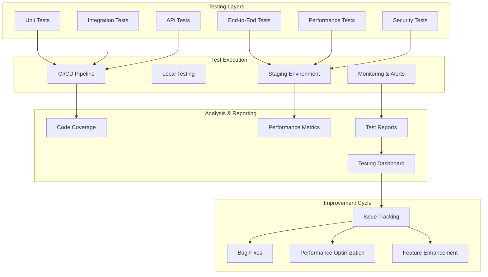

# Design Document

## Overview

The Product Testing and Improvement system provides comprehensive validation and enhancement of the document learning application. This design outlines a multi-layered testing approach including automated testing, performance benchmarking, user experience validation, and continuous improvement processes. The system will identify issues, measure performance, and implement optimizations to ensure production readiness.

### Key Design Principles

- **Comprehensive Coverage**: Test all layers from unit to end-to-end scenarios
- **Automated Validation**: Minimize manual testing through automation
- **Performance Focus**: Measure and optimize system performance continuously
- **User-Centric**: Validate actual user workflows and experiences
- **Continuous Improvement**: Iterative testing and enhancement cycles

## Architecture

### Testing Architecture



### Technology Stack

**Testing Frameworks:**
- pytest - Python backend testing
- Jest + React Testing Library - Frontend unit/integration testing
- Playwright - End-to-end testing
- Locust - Load and performance testing
- OWASP ZAP - Security testing

**Monitoring & Analysis:**
- Prometheus - Metrics collection
- Grafana - Performance dashboards
- Sentry - Error tracking and monitoring
- Lighthouse - Frontend performance auditing
- SonarQube - Code quality analysis

**CI/CD & Automation:**
- GitHub Actions - Automated testing pipeline
- Docker - Containerized test environments
- Allure - Test reporting and visualization
- Coverage.py - Code coverage measurement

## Components and Interfaces

### Test Suite Architecture

```python
class TestSuite:
    """Main test suite coordinator"""
    
    def __init__(self):
        self.unit_tests = UnitTestRunner()
        self.integration_tests = IntegrationTestRunner()
        self.api_tests = APITestRunner()
        self.e2e_tests = E2ETestRunner()
        self.performance_tests = PerformanceTestRunner()
        self.security_tests = SecurityTestRunner()
        
    async def run_full_suite(self) -> TestResults:
        """Execute complete test suite"""
        results = TestResults()
        
        # Run tests in order of dependency
        results.unit = await self.unit_tests.run()
        if results.unit.passed:
            results.integration = await self.integration_tests.run()
            
        if results.integration.passed:
            results.api = await self.api_tests.run()
            results.e2e = await self.e2e_tests.run()
            
        # Performance and security tests run independently
        results.performance = await self.performance_tests.run()
        results.security = await self.security_tests.run()
        
        return results
```

### Unit Testing Framework

```python
class UnitTestRunner:
    """Comprehensive unit testing for all components"""
    
    def __init__(self):
        self.test_categories = {
            'parsers': ParserTests(),
            'nlp': NLPTests(),
            'cards': CardGenerationTests(),
            'srs': SRSAlgorithmTests(),
            'search': SearchTests(),
            'api': APIUnitTests(),
            'frontend': FrontendComponentTests()
        }
        
    async def run(self) -> UnitTestResults:
        """Run all unit tests with coverage measurement"""
        results = UnitTestResults()
        
        for category, test_runner in self.test_categories.items():
            category_results = await test_runner.run_with_coverage()
            results.add_category(category, category_results)
            
        return results

class ParserTests:
    """Test document parsing functionality"""
    
    def test_pdf_text_extraction(self):
        """Test PDF text extraction accuracy"""
        parser = PDFParser()
        content = parser.parse('test_documents/sample.pdf')
        
        assert len(content.text_blocks) > 0
        assert all(block.text.strip() for block in content.text_blocks)
        assert all(block.page > 0 for block in content.text_blocks)
        
    def test_pdf_image_extraction(self):
        """Test PDF image extraction with coordinates"""
        parser = PDFParser()
        content = parser.parse('test_documents/with_images.pdf')
        
        assert len(content.images) >= 2
        for image in content.images:
            assert image.bbox['width'] > 0
            assert image.bbox['height'] > 0
            assert os.path.exists(image.image_path)
            
    def test_chapter_recognition(self):
        """Test chapter structure recognition accuracy"""
        parser = PDFParser()
        content = parser.parse('test_documents/structured.pdf')
        
        chapters = extract_chapters(content)
        expected_chapters = load_expected_chapters('structured.pdf')
        
        accuracy = calculate_chapter_accuracy(chapters, expected_chapters)
        assert accuracy >= 0.95  # 95% accuracy requirement
```

### Integration Testing Framework

```python
class IntegrationTestRunner:
    """Test complete workflows and component interactions"""
    
    async def test_document_processing_pipeline(self):
        """Test complete document processing workflow"""
        # Upload document
        doc_id = await self.upload_test_document('sample.pdf')
        
        # Wait for processing with timeout
        await self.wait_for_processing(doc_id, timeout=60)
        
        # Verify all stages completed
        doc = await self.get_document(doc_id)
        assert doc.status == 'completed'
        
        # Verify chapters were created
        chapters = await self.get_chapters(doc_id)
        assert len(chapters) >= 1
        
        # Verify knowledge points were extracted
        knowledge = await self.get_knowledge_points(doc_id)
        assert len(knowledge) >= 5
        
        # Verify cards were generated
        cards = await self.get_cards(doc_id)
        assert len(cards) >= 3
        
        # Test card review workflow
        card = cards[0]
        await self.grade_card(card.id, 4)
        
        updated_srs = await self.get_srs_state(card.id)
        assert updated_srs.due_date > datetime.now()
        
    async def test_search_functionality(self):
        """Test search and filtering integration"""
        # Ensure test data exists
        await self.setup_search_test_data()
        
        # Test full-text search
        results = await self.search('machine learning')
        assert len(results) > 0
        assert any('machine learning' in r.text.lower() for r in results)
        
        # Test semantic search
        semantic_results = await self.semantic_search('AI algorithms')
        assert len(semantic_results) > 0
        
        # Test filtering
        filtered = await self.search_with_filters(
            query='learning',
            chapter_ids=['chapter-1'],
            difficulty_range=(0.3, 0.7)
        )
        assert all(r.difficulty >= 0.3 and r.difficulty <= 0.7 for r in filtered)
```

### Performance Testing Framework

```python
class PerformanceTestRunner:
    """Measure and validate system performance"""
    
    def __init__(self):
        self.benchmarks = {
            'document_processing': DocumentProcessingBenchmark(),
            'search_performance': SearchPerformanceBenchmark(),
            'frontend_loading': FrontendLoadingBenchmark(),
            'api_response_times': APIResponseBenchmark(),
            'concurrent_users': ConcurrentUserBenchmark()
        }
        
    async def run(self) -> PerformanceResults:
        """Run all performance benchmarks"""
        results = PerformanceResults()
        
        for name, benchmark in self.benchmarks.items():
            benchmark_result = await benchmark.run()
            results.add_benchmark(name, benchmark_result)
            
        return results

class DocumentProcessingBenchmark:
    """Benchmark document processing performance"""
    
    async def run(self) -> BenchmarkResult:
        """Test processing time for various document sizes"""
        test_documents = [
            ('small.pdf', 5, 15),    # 5 pages, max 15 seconds
            ('medium.pdf', 20, 45),  # 20 pages, max 45 seconds
            ('large.pdf', 50, 120),  # 50 pages, max 2 minutes
        ]
        
        results = []
        for filename, pages, max_time in test_documents:
            start_time = time.time()
            
            doc_id = await self.upload_document(filename)
            await self.wait_for_processing(doc_id)
            
            processing_time = time.time() - start_time
            results.append({
                'filename': filename,
                'pages': pages,
                'processing_time': processing_time,
                'max_time': max_time,
                'passed': processing_time <= max_time
            })
            
        return BenchmarkResult('document_processing', results)

class SearchPerformanceBenchmark:
    """Benchmark search performance and accuracy"""
    
    async def run(self) -> BenchmarkResult:
        """Test search response times and accuracy"""
        test_queries = [
            'machine learning',
            'neural networks',
            'data structures',
            'algorithms',
            'artificial intelligence'
        ]
        
        results = []
        for query in test_queries:
            # Test response time
            start_time = time.time()
            search_results = await self.search(query)
            response_time = time.time() - start_time
            
            # Test accuracy (if we have ground truth)
            accuracy = await self.calculate_search_accuracy(query, search_results)
            
            results.append({
                'query': query,
                'response_time': response_time,
                'result_count': len(search_results),
                'accuracy': accuracy,
                'passed': response_time <= 0.5  # 500ms requirement
            })
            
        return BenchmarkResult('search_performance', results)
```

### End-to-End Testing Framework

```python
class E2ETestRunner:
    """Test complete user workflows using browser automation"""
    
    def __init__(self):
        self.playwright = None
        self.browser = None
        self.page = None
        
    async def setup(self):
        """Initialize browser for testing"""
        self.playwright = await async_playwright().start()
        self.browser = await self.playwright.chromium.launch()
        self.page = await self.browser.new_page()
        
    async def test_complete_learning_workflow(self):
        """Test complete user learning workflow"""
        await self.setup()
        
        try:
            # Navigate to application
            await self.page.goto('http://localhost:3000')
            
            # Upload document
            await self.upload_document_via_ui('test_document.pdf')
            
            # Wait for processing to complete
            await self.wait_for_processing_complete()
            
            # Navigate to study page
            await self.page.click('[data-testid="study-button"]')
            
            # Review cards
            for i in range(5):
                # Wait for card to load
                await self.page.wait_for_selector('[data-testid="flashcard"]')
                
                # Flip card
                await self.page.click('[data-testid="flip-button"]')
                
                # Grade card
                await self.page.click('[data-testid="grade-4"]')
                
                # Verify next card loads
                await self.page.wait_for_timeout(500)
                
            # Test search functionality
            await self.page.click('[data-testid="search-tab"]')
            await self.page.fill('[data-testid="search-input"]', 'test query')
            await self.page.press('[data-testid="search-input"]', 'Enter')
            
            # Verify search results
            await self.page.wait_for_selector('[data-testid="search-results"]')
            results = await self.page.query_selector_all('[data-testid="search-result"]')
            assert len(results) > 0
            
        finally:
            await self.browser.close()
            await self.playwright.stop()
```

### Security Testing Framework

```python
class SecurityTestRunner:
    """Test security vulnerabilities and data protection"""
    
    async def test_file_upload_security(self):
        """Test file upload security measures"""
        # Test malicious file rejection
        malicious_files = [
            'malicious.exe',
            'script.js',
            'payload.php',
            'large_file.pdf'  # Oversized file
        ]
        
        for filename in malicious_files:
            response = await self.upload_file(filename)
            assert response.status_code == 400
            assert 'rejected' in response.json()['message'].lower()
            
    async def test_privacy_mode(self):
        """Test privacy mode functionality"""
        # Enable privacy mode
        await self.set_privacy_mode(True)
        
        # Process document
        doc_id = await self.upload_document('test.pdf')
        await self.wait_for_processing(doc_id)
        
        # Verify no external API calls were made
        external_calls = await self.get_external_api_calls()
        assert len(external_calls) == 0
        
    async def test_data_sanitization(self):
        """Test data sanitization in logs"""
        # Upload document with sensitive filename
        sensitive_filename = 'john_doe_medical_records.pdf'
        doc_id = await self.upload_document(sensitive_filename)
        
        # Check logs for sanitization
        logs = await self.get_application_logs()
        assert sensitive_filename not in ' '.join(logs)
        assert any('***' in log for log in logs)  # Sanitized content
```

## Data Models

### Test Results Schema

```python
class TestResults:
    """Comprehensive test results structure"""
    
    def __init__(self):
        self.unit_tests = UnitTestResults()
        self.integration_tests = IntegrationTestResults()
        self.api_tests = APITestResults()
        self.e2e_tests = E2ETestResults()
        self.performance_tests = PerformanceResults()
        self.security_tests = SecurityTestResults()
        self.overall_status = TestStatus.PENDING
        
    def calculate_overall_status(self):
        """Calculate overall test status"""
        all_results = [
            self.unit_tests.status,
            self.integration_tests.status,
            self.api_tests.status,
            self.e2e_tests.status,
            self.performance_tests.status,
            self.security_tests.status
        ]
        
        if all(status == TestStatus.PASSED for status in all_results):
            self.overall_status = TestStatus.PASSED
        elif any(status == TestStatus.FAILED for status in all_results):
            self.overall_status = TestStatus.FAILED
        else:
            self.overall_status = TestStatus.PARTIAL

class BenchmarkResult:
    """Performance benchmark result"""
    
    def __init__(self, name: str, measurements: list):
        self.name = name
        self.measurements = measurements
        self.average_time = self.calculate_average()
        self.passed = all(m.get('passed', True) for m in measurements)
        
    def calculate_average(self) -> float:
        """Calculate average measurement time"""
        times = [m.get('processing_time', 0) for m in self.measurements]
        return sum(times) / len(times) if times else 0
```

### Issue Tracking Schema

```python
class TestIssue:
    """Represents an issue found during testing"""
    
    def __init__(self):
        self.id = uuid4()
        self.title = ""
        self.description = ""
        self.severity = IssueSeverity.MEDIUM
        self.category = IssueCategory.BUG
        self.test_case = ""
        self.reproduction_steps = []
        self.expected_behavior = ""
        self.actual_behavior = ""
        self.environment = {}
        self.status = IssueStatus.OPEN
        self.created_at = datetime.now()
        
class IssueSeverity(Enum):
    CRITICAL = "critical"
    HIGH = "high"
    MEDIUM = "medium"
    LOW = "low"
    
class IssueCategory(Enum):
    BUG = "bug"
    PERFORMANCE = "performance"
    SECURITY = "security"
    USABILITY = "usability"
    ACCESSIBILITY = "accessibility"
```

## Error Handling

### Test Failure Management

```python
class TestFailureHandler:
    """Handle test failures and recovery"""
    
    async def handle_test_failure(self, test_name: str, error: Exception):
        """Process test failure and determine next steps"""
        issue = TestIssue()
        issue.title = f"Test failure: {test_name}"
        issue.description = str(error)
        issue.severity = self.determine_severity(test_name, error)
        
        # Log failure
        await self.log_test_failure(issue)
        
        # Determine if testing should continue
        if issue.severity == IssueSeverity.CRITICAL:
            await self.halt_testing_pipeline()
        else:
            await self.continue_with_remaining_tests()
            
    def determine_severity(self, test_name: str, error: Exception) -> IssueSeverity:
        """Determine issue severity based on test and error"""
        critical_tests = ['security', 'data_integrity', 'core_functionality']
        
        if any(critical in test_name.lower() for critical in critical_tests):
            return IssueSeverity.CRITICAL
        elif 'performance' in test_name.lower():
            return IssueSeverity.HIGH
        else:
            return IssueSeverity.MEDIUM
```

### Continuous Improvement Process

```python
class ImprovementEngine:
    """Analyze test results and suggest improvements"""
    
    def __init__(self):
        self.analyzers = [
            PerformanceAnalyzer(),
            CodeQualityAnalyzer(),
            UserExperienceAnalyzer(),
            SecurityAnalyzer()
        ]
        
    async def analyze_results(self, test_results: TestResults) -> list[Improvement]:
        """Analyze test results and suggest improvements"""
        improvements = []
        
        for analyzer in self.analyzers:
            analyzer_improvements = await analyzer.analyze(test_results)
            improvements.extend(analyzer_improvements)
            
        # Prioritize improvements
        improvements.sort(key=lambda x: x.priority, reverse=True)
        
        return improvements
        
class PerformanceAnalyzer:
    """Analyze performance test results"""
    
    async def analyze(self, results: TestResults) -> list[Improvement]:
        """Identify performance improvement opportunities"""
        improvements = []
        
        # Check document processing times
        processing_results = results.performance_tests.get_benchmark('document_processing')
        if processing_results:
            slow_tests = [r for r in processing_results.measurements if not r['passed']]
            
            if slow_tests:
                improvements.append(Improvement(
                    title="Optimize document processing performance",
                    description=f"Processing time exceeded limits for {len(slow_tests)} test cases",
                    priority=ImprovementPriority.HIGH,
                    category=ImprovementCategory.PERFORMANCE,
                    suggested_actions=[
                        "Profile document parsing code",
                        "Implement parallel processing",
                        "Optimize memory usage",
                        "Add caching for repeated operations"
                    ]
                ))
                
        return improvements
```

This comprehensive design provides a robust framework for testing and improving the document learning application. The multi-layered approach ensures thorough validation while the continuous improvement process helps maintain and enhance product quality over time.